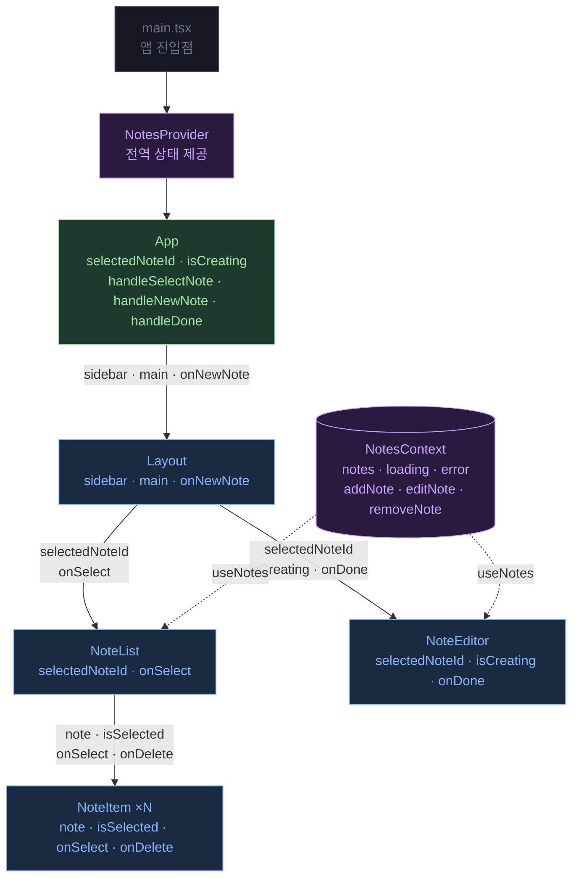

컴포넌트 계층 구조, props 방향, Context 소비 관계

## 계층 구조 및 Props 흐름

## 컴포넌트별 Props 명세

| 컴포넌트 | Prop | 타입 | 출처 | 설명 |
|---------|------|------|------|------|
| Layout | `sidebar` | `ReactNode` | App ↓ | 좌측 패널 슬롯 — NoteList 전달 |
| Layout | `main` | `ReactNode` | App ↓ | 우측 패널 슬롯 — NoteEditor 전달 |
| Layout | `onNewNote` | `() => void` | App ↑ | 새 노트 버튼 클릭 콜백 |
| NoteList | `selectedNoteId` | `string \| null` | App ↓ | 현재 선택된 노트 ID (선택 하이라이트) |
| NoteList | `onSelect` | `(id: string) => void` | App ↑ | 노트 선택 콜백 → App.selectedNoteId 갱신 |
| NoteItem | `note` | `Note` | NoteList ↓ | 렌더링할 노트 객체 |
| NoteItem | `isSelected` | `boolean` | NoteList ↓ | 선택 상태 (테두리 스타일 제어) |
| NoteItem | `onSelect` | `(id: string) => void` | NoteList ↑ | 클릭 시 호출 |
| NoteItem | `onDelete` | `(id: string) => void` | Context | 삭제 버튼 — removeNote 직접 전달 |
| NoteEditor | `selectedNoteId` | `string \| null` | App ↓ | 편집 대상 노트 ID |
| NoteEditor | `isCreating` | `boolean` | App ↓ | 신규 생성 모드 여부 |
| NoteEditor | `onDone` | `() => void` | App ↑ | 저장/취소 후 isCreating 초기화 |
