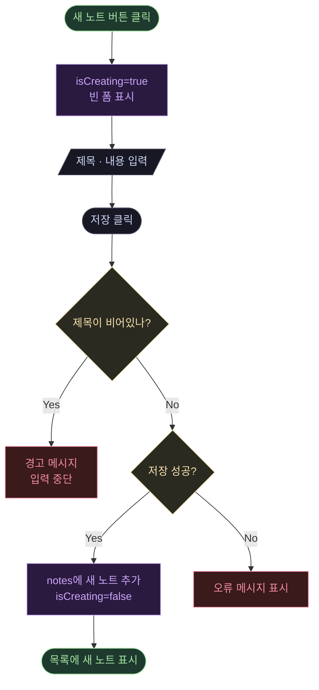
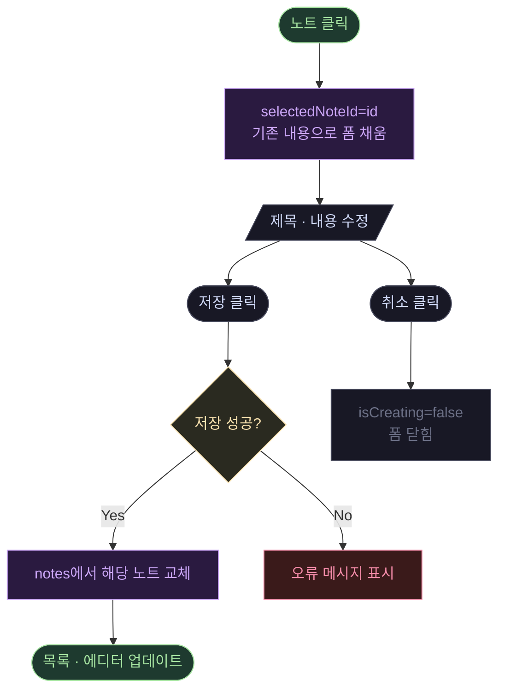
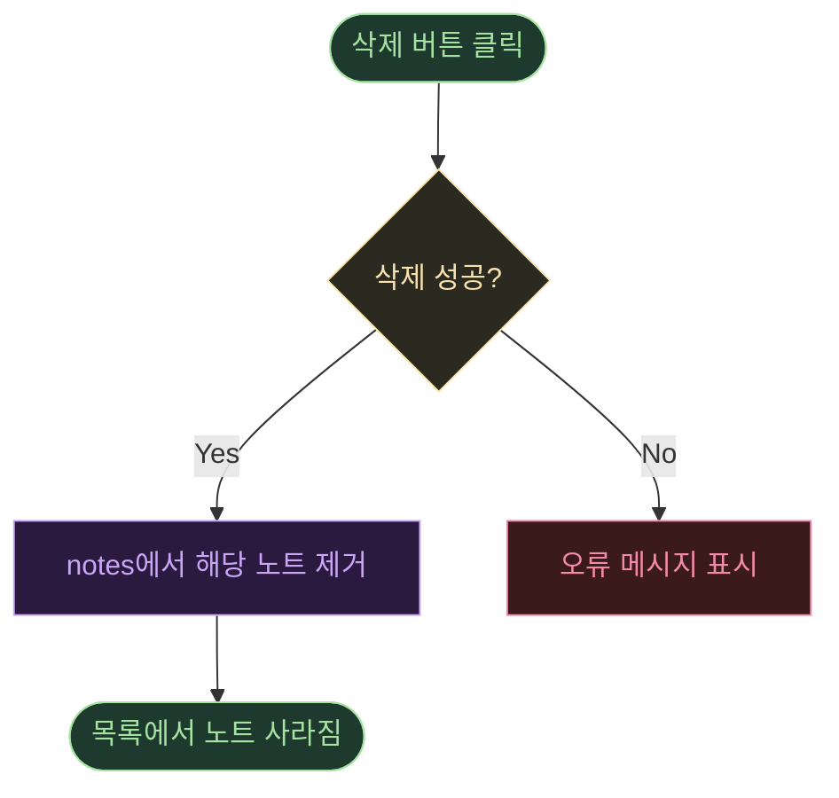

import Tabs from '@theme/Tabs';
import TabItem from '@theme/TabItem';

사용자 액션 기준 — 노트 생성 / 수정 / 삭제 비즈니스 플로우

<Tabs>
  <TabItem value="create" label="노트 생성" default>

  </TabItem>
  <TabItem value="edit" label="노트 수정">

  </TabItem>
  <TabItem value="delete" label="노트 삭제">

  </TabItem>
</Tabs>
