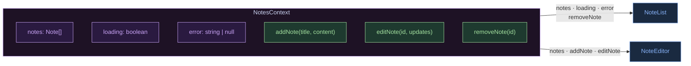
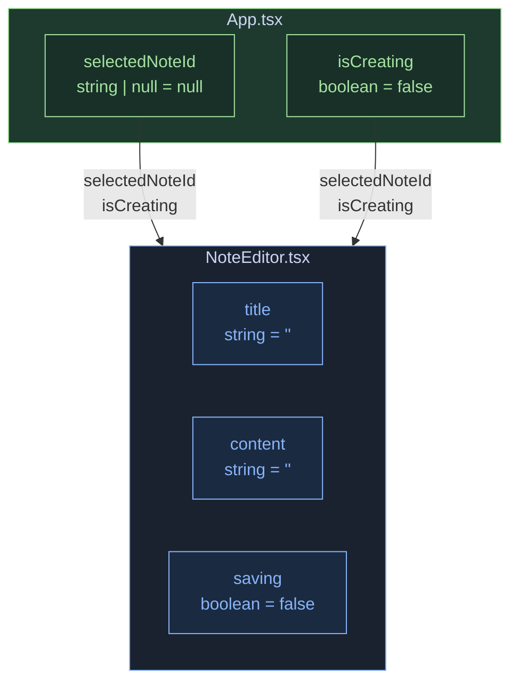

전역 Context 상태, 컴포넌트 로컬 상태

## 전역 상태 — NotesContext

## 컴포넌트별 로컬 상태

## 상태 명세

### 전역 상태 (Context)

| 변수 | 타입 | 초기값 |
|------|------|--------|
| `notes` | `Note[]` | `[]` |
| `loading` | `boolean` | `true` |
| `error` | `string \| null` | `null` |

### 로컬 상태 (useState)

| 변수 | 타입 | 위치 |
|------|------|------|
| `selectedNoteId` | `string \| null` | App |
| `isCreating` | `boolean` | App |
| `title` | `string` | NoteEditor |
| `content` | `string` | NoteEditor |
| `saving` | `boolean` | NoteEditor |
